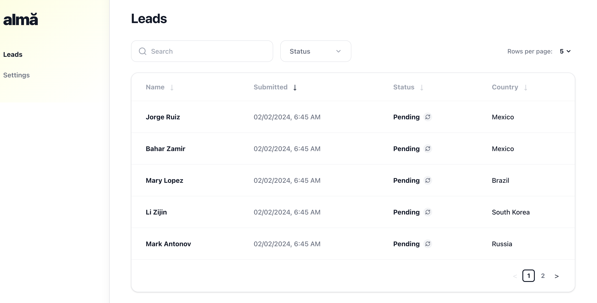
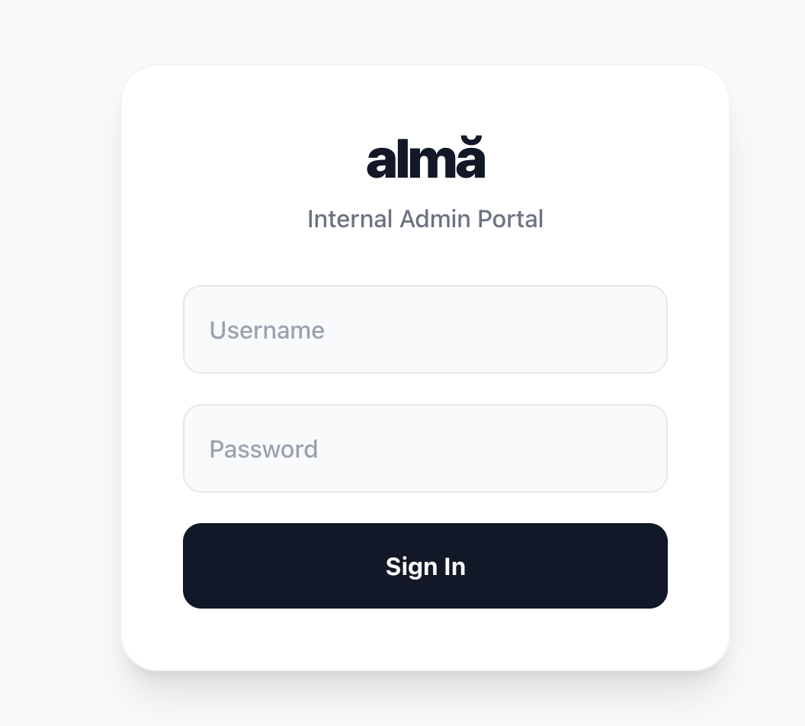

# Alma Leads Management System

### How to Run Locally

1. Clone the repository.
2. Run `npm install`.
3. Run `npm run dev`.
4. Navigate to `http://localhost:3000` for the Public Form.
5. Navigate to `http://localhost:3000/admin` for the Internal Dashboard. (login credentials are: `admin` and `password`).

### Testing

Run `npm run test` to execute the Jest unit tests.

## Screenshots

## System Design & Architecture (Development Time, About 4 hours)

### 1. Overview & Core Directives

This application is a full-stack lead generation tool custom-built using **Next.js (App Router)**, **React**, **Tailwind CSS**, and **Redux Toolkit**. It consists of a public-facing lead capture form and a private, mock-authenticated internal Admin Dashboard to manage those leads.

We avoided heavy layout libraries (like JSONForms or React Hook Form) to keep the application lightweight and fast. Instead, we used native React state and HTML5 validation to build a pixel-perfect match of the provided design mockups.

### 2. Technology Stack

- **Frontend Framework (Next.js & React):** Provides a robust, SEO-friendly, and highly performant foundation. The App Router handles both our user interfaces and our mock backend APIs (`/api/leads`) seamlessly in one codebase project.
- **State Management (Redux Toolkit):** Powers the Admin Dashboard's memory. It allows us to instantly update lead statuses (e.g., `PENDING` to `REACHED_OUT`) and safely share data across components without messy "prop-drilling".
- **Styling (Tailwind CSS):** Used for rapid styling that precisely matches the Figma mockups. It naturally handles mobile responsiveness (collapsing sidebars on phones) and interactive UI states (hover effects).
- **Mocked Backend (Next.js API Routes):** We simulate a real backend server by storing data in an in-memory array (`globalThis` singleton cache). This allows standard HTTP GET/POST requests to behave exactly like a real production database.

### 3. Public Lead Form Architecture (`app/page.tsx` & `LeadForm.tsx`)

- **Native Form Magic:** The form captures user input and validates it instantly on the client side. For example, if a user types numbers into the "First Name" field, native HTML5 browser popups warn them immediately—no heavy external validation libraries were required.
- **Smart Feedback:** Text areas dynamically calculate exactly how many characters are mathematically missing before validating successfully, creating a highly empathetic user experience.
- **React-Select:** For complicated UI elements like the Country dropdown, we utilize `react-select` inside a fixed portal layout, ensuring the dropdown menu never incorrectly slides underneath other page elements.

### 4. Admin Dashboard Architecture (`app/admin/page.tsx`)

- **Mock Authentication:** The internal portal is safely hidden behind a fullscreen login overlay. Until the user types the exact credentials (`admin` / `password`), the underlying admin layout and data arrays remain hidden securely.
- **Lightning Fast Sorting & Filtering:** When an admin searches for a lead or sorts by date, it happens instantly (in 0 milliseconds). We process the search text and sorting commands _locally_ using React's `useMemo` algorithmic loops, altogether avoiding slow network requests back to the server.
- **Real-Time Auto Sync:** The dashboard runs an automatic, quiet loop polling the server every 10 seconds. If a new lead is submitted on the public website, it dynamically pops into the Admin Dashboard natively without any manual page refreshes.

### 5. Pros, Cons, and Future Roadmap

**The Pros:**

- Extremely lightning-fast experience for the user.
- Very small overall application size.
- A highly polished design.

**The Cons:**

- Processing massive databases (e.g., millions of leads) using local React filtering could eventually slow down a browser tab.
- Since the database is mocked in server memory, restarting the actual Node.js backend completely erases newly submitted leads.

**Future Improvements for Production (v1.0):**

1. **Connect to a Real Database:** Swap the `globalThis` mock array out for PostgreSQL and an ORM like Prisma. Our API route structure is perfectly shaped to make this transition flawless.
2. **Stronger Authentication:** Replace our mock Javascript fullscreen overlay with robust session tokens using enterprise libraries like **NextAuth.js (Auth.js)**.
